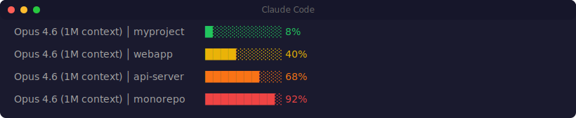
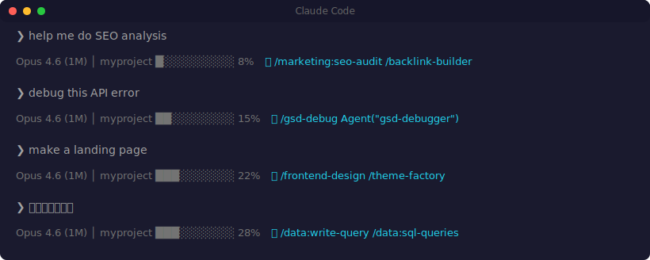

# CC Status Board

> Smart status bar for Claude Code — context meter, AI asset discovery, and session info at a glance.

**[Install from TokRepo](https://tokrepo.com/en/workflows/e7e9ac68-7ad5-4ae9-9e76-d2a338dc0990)** — the original publishing platform for AI assets.



## What It Does

CC Status Board adds three features to your Claude Code status bar:

### 1. Context Meter

See how much of your context window you've used — at a glance. Color-coded: green (< 50%) → yellow (50-65%) → orange (65-80%) → blinking red (80%+).

### 2. AI Asset Discovery

As you type, the most relevant installed AI assets appear in your status bar. No extra tokens consumed — matching runs 100% locally using intent classification + TF-IDF scoring.



**Scans all your installed assets:**
- Skills (`~/.claude/skills/`)
- Agents (`~/.claude/agents/`)
- Commands (`~/.claude/commands/`)
- Plugins (Claude Code built-in plugins)
- MCP Servers (`.mcp.json`)

**Smart matching (not just keyword search):**
- 35+ intent categories with CJK + English aliases
- **Bilingual keywords** — LLM generates Chinese keywords for English assets at index time, so Chinese queries match English tools
- TF-IDF weighting — rare keywords matter more
- Specificity bonus — specialist tools rank above generalists
- Diversity filter — no more than 2 results from the same namespace

### 3. Model & Directory Info

Always shows your current model, context window size, and working directory.

```
Opus 4.6 (1M context) │ myproject █░░░░░░░░░ 12%
Sonnet 4.6 (200K context) │ webapp ███░░░░░░░ 28%
```

## Install

**Recommended:** Install from [TokRepo](https://tokrepo.com/en/workflows/e7e9ac68-7ad5-4ae9-9e76-d2a338dc0990) for one-click setup.

Or install from source:

```bash
git clone https://github.com/henu-wang/cc-status-board.git
cd cc-status-board
node install.js
```

Then **restart Claude Code**.

## How It Works

```
┌─────────────────────────────────────────────────┐
│ You type a message                              │
│           │                                     │
│           ▼                                     │
│ UserPromptSubmit hook                           │
│  → Tokenize (CJK bigrams + Latin words)        │
│  → Detect intents (35+ categories)             │
│  → Score assets (TF-IDF + specificity)         │
│  → Write top 3 to temp bridge file             │
│           │                                     │
│           ▼                                     │
│ Statusline reads bridge file                    │
│  → Display: model │ dir │ context% │ 💡 assets │
└─────────────────────────────────────────────────┘
```

**Zero token consumption.** Everything runs as local Node.js processes.

## Rebuild Asset Index

When you install new skills, MCP servers, or plugins:

```bash
node ~/.claude/hooks/cc-build-index.js
```

## Uninstall

Remove from `~/.claude/settings.json`:
1. Delete the `statusLine` entry
2. Remove the `cc-asset-suggest` entry from `hooks.UserPromptSubmit`
3. Delete the hook files:

```bash
rm ~/.claude/hooks/cc-statusline.js
rm ~/.claude/hooks/cc-asset-suggest.js
rm ~/.claude/hooks/cc-build-index.js
rm ~/.claude/cache/asset-index.json
```

## Bilingual Matching (v1.1)

By default, asset names and descriptions are in English. If you type in Chinese (or other CJK languages), only intent detection works — keyword and description matching won't fire.

**To enable bilingual keywords**, set an OpenAI-compatible API key before building the index:

```bash
export CC_LLM_API_KEY="sk-..."          # or OPENAI_API_KEY
export CC_LLM_BASE_URL="https://api.openai.com/v1"  # optional, default OpenAI
export CC_LLM_MODEL="gpt-4o-mini"       # optional, default gpt-4o-mini
node ~/.claude/hooks/cc-build-index.js
```

The index builder will call the LLM once per ~30 assets to generate Chinese search keywords. These are stored in the local index — **zero extra cost at query time**.

Works with any OpenAI-compatible provider (OpenAI, Azure, vLLM, Ollama, etc.).

## Configuration

The status bar works out of the box. To customize:

| What | How |
|------|-----|
| Enable bilingual matching | Set `CC_LLM_API_KEY` env var, then rebuild index |
| Change bar width | Edit `statusline.js`, change `Math.floor(used / 10)` denominator |
| Add intent categories | Edit `build-index.js`, add to `INTENT_TAXONOMY` |
| Change max suggestions | Edit `asset-suggest.js`, change `MAX_SUGGESTIONS` |
| Adjust match threshold | Edit `asset-suggest.js`, change `MIN_SCORE` |

## Requirements

- Claude Code (CLI, desktop, or IDE extension)
- Node.js >= 18

## License

MIT

## Acknowledgments

Inspired by [Get Shit Done (GSD)](https://github.com/gsd-build/get-shit-done) — the statusline hook architecture and context monitoring patterns originated from this project. If you're building non-trivial projects with Claude Code, GSD is a game changer.

## Author

Built by [William Wang](https://github.com/henu-wang) — founder of [TokRepo](https://tokrepo.com), [GEOScore AI](https://geoscoreai.com), and [KeepRule](https://keeprule.com).
